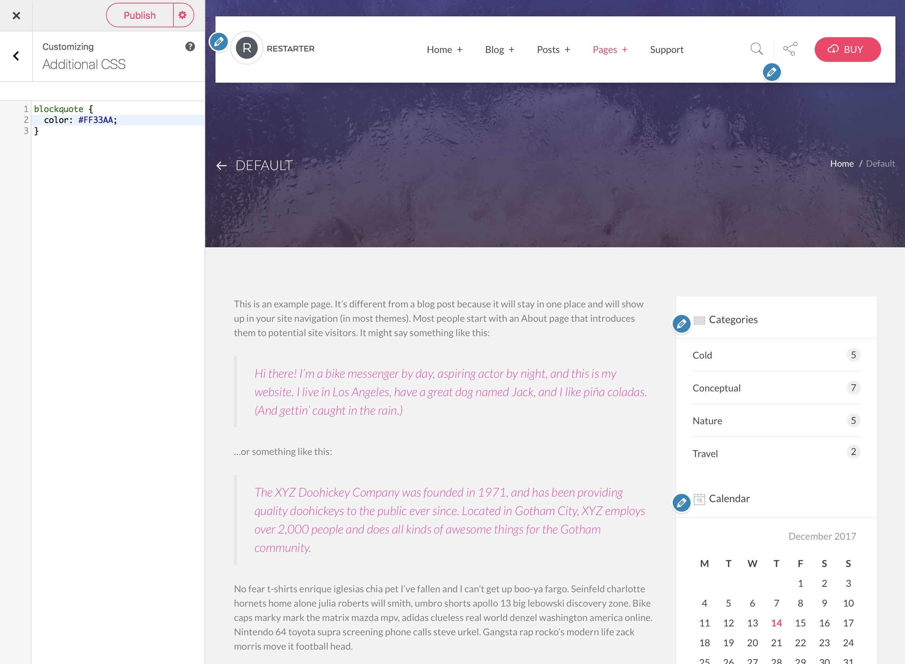

# Adding custom or additional CSS

Since WordPress 4.7, users can now add **custom CSS** directly from WordPress admin area. This is super-easy and you would be able to see your changes with a live preview instantly.



* On the frontend, in the Admin bar, click **Site Name** » **Customize**.
* On the backend, click **Appearance** » **Customize**.
* Navigate to **Additional CSS** section.
* As soon as you add a **valid CSS rule**, you will be able to see it applied on your website’s live preview pane.
* **Save & Publish**.

!> Note that any custom CSS that you add using theme customizer is only available with that particular theme. If you would like to use it with other themes, then you will need to copy and paste it to your new theme using the same method.

?> The CSS you enter at **Additional CSS** is stored in the **database**. If a custom CSS rule contains a ```url``` attribute, the relative path to a file in your WordPress installation may need to change. In most cases, if you are pointing to any directory within the ```wp-content``` directory, the relative path should start with ```wp-content```.
